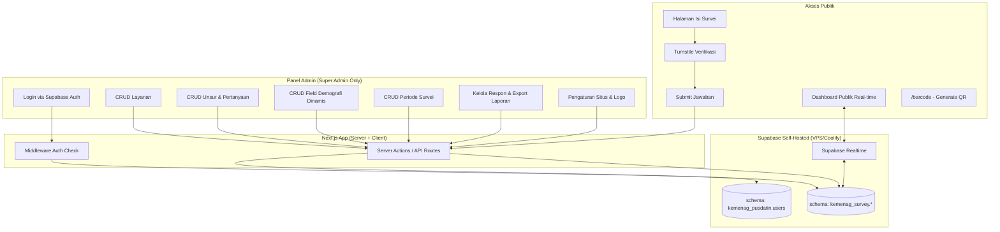

# Product Requirements Document (PRD)
# SIKAP — Sistem Informasi Kepuasan dan Aspirasi Publik

**Instansi:** Kantor Kementerian Agama Kabupaten Barito Utara
**Modul:** Survei Kepuasan Masyarakat (SKM) — Layanan PTSP
**Versi Dokumen:** 1.0
**Tanggal:** 6 Juli 2026
**Disusun untuk:** Tim Pengembang Internal (Kemenag Barito Utara)

---

## 1. Latar Belakang

Kantor Kementerian Agama Kabupaten Barito Utara telah memiliki sistem layanan **PTSP (Pelayanan Terpadu Satu Pintu)** untuk administrasi ASN/PNS/PPPK (cuti, kenaikan pangkat, kenaikan gaji berkala, mutasi, pensiun, dll). Untuk mengukur kualitas layanan tersebut secara berkala dan sesuai regulasi, dibutuhkan sistem **Survei Kepuasan Masyarakat (SKM)** yang:

- Mengukur **Indeks Persepsi Kualitas Pelayanan (IPKP)** dan **Indeks Persepsi Anti Korupsi (IPAK)** dalam **satu survei gabungan**, namun tetap menghasilkan **dua skor indeks terpisah**.
- Mengacu pada **Peraturan Menteri PANRB No. 14 Tahun 2017** tentang Pedoman Penyusunan Survei Kepuasan Masyarakat.
- Dikelola sepenuhnya secara dinamis oleh **1 (satu) akun Super Admin**, tanpa perlu campur tangan developer untuk mengubah unsur, pertanyaan, layanan, atau periode survei.
- Menampilkan hasil secara **real-time ke publik**, mendukung QR Code untuk akses cepat di loket layanan, dan dilindungi dari spam/bot.

Dokumen ini menjadi acuan utama pengembangan sistem tersebut.

---

## 2. Tujuan Produk

1. Menyediakan satu portal survei kepuasan masyarakat yang mencakup **seluruh jenis layanan PTSP** (dipilih responden saat mengisi).
2. Menghasilkan **Nilai IPKP** dan **Nilai IPAK** secara otomatis sesuai formula tetap Permenpan RB 14/2017.
3. Memungkinkan Super Admin mengelola **layanan, unsur penilaian, pertanyaan, field demografi, dan periode survei** secara dinamis lewat panel admin — tanpa perlu deploy ulang kode.
4. Mendukung pengisian survei secara **anonim atau terbuka (identitas)**, sesuai pilihan responden sendiri.
5. Menyediakan **dashboard publik real-time** dan **export laporan resmi** (Excel/PDF format Kemenpan RB).
6. Mendukung **multi-bahasa otomatis (ID/EN)**.
7. Melindungi integritas data dari bot/spam menggunakan **Cloudflare Turnstile**.

---

## 3. Ruang Lingkup (Scope)

### Termasuk dalam scope:
- Halaman publik pengisian survei (dinamis, star rating).
- Dashboard publik hasil real-time (IPKP & IPAK, per layanan, per periode).
- Halaman `/barcode` untuk generate & download QR Code tautan survei.
- Panel admin (Super Admin only) dengan CRUD penuh.
- Export laporan format resmi Kemenpan RB (Excel & PDF).
- Autentikasi terpusat via Supabase Auth (schema `kemenag_pusdatin`).
- Multi-bahasa ID/EN otomatis (deteksi browser + manual switch).

### Tidak termasuk dalam scope (Fase 1):
- Multi-tenant (khusus Kemenag Barito Utara saja).
- Multi-role admin (hanya 1 akun Super Admin).
- Integrasi notifikasi Telegram/n8n (sudah dikonfirmasi tidak diperlukan).
- Aplikasi mobile native.

---

## 4. Tech Stack

| Layer | Teknologi | Keterangan |
|---|---|---|
| Framework | **Next.js (App Router)** | Full-stack — Server Components, Server Actions, API Routes |
| Bahasa | TypeScript | Type-safety end-to-end |
| Database & Auth | **Supabase (self-hosted di VPS via Coolify)** | Schema baru `kemenag_survey`; Auth terpusat di schema `kemenag_pusdatin` |
| Styling/UI | Tailwind CSS + shadcn/ui (Radix) | Konsisten untuk dashboard admin & publik |
| Grafik | Recharts | Visualisasi index, trend, demografi |
| Data Fetching/Cache | TanStack React Query | Dipadukan Supabase Realtime channel |
| Form & Validasi | React Hook Form + Zod | Form builder dinamis di admin, validasi ketat |
| i18n | next-intl | Deteksi otomatis + manual switch ID/EN |
| Export Excel | ExcelJS | Format tabel sesuai lampiran resmi Permenpan |
| Export PDF | @react-pdf/renderer | Laporan hasil IPKP/IPAK |
| QR Code | `qrcode` | Generate & download QR di halaman `/barcode` |
| Anti-Spam | Cloudflare Turnstile (`@marsidev/react-turnstile`) | Proteksi submission publik |
| Utilitas Tanggal | date-fns | Perhitungan periode triwulan/semester/tahun |
| Animasi | Framer Motion | UX star rating & transisi form |
| Hosting | VPS mandiri via **Coolify** | Self-hosted, satu server dengan Supabase |

### Instalasi Awal
```bash
npx create-next-app@latest sikap-survey --typescript --tailwind --app

npm install @supabase/supabase-js @supabase/ssr \
  react-hook-form zod @hookform/resolvers \
  lucide-react recharts @tanstack/react-query \
  next-intl exceljs @react-pdf/renderer qrcode \
  @marsidev/react-turnstile date-fns framer-motion

npm install -D @types/qrcode

npx shadcn@latest init
```

---

## 5. Arsitektur Sistem



**Poin penting arsitektur:**
- Autentikasi Super Admin memvalidasi terhadap tabel `kemenag_pusdatin.users` (email resmi: `baritoutara@kemenag.go.id`), **bukan** membuat sistem auth baru.
- Middleware Next.js membatasi akses `/admin/*` hanya untuk user dengan email tersebut (dicek via RLS + server-side check, bukan hanya client-side).
- Seluruh data survei (layanan, unsur, pertanyaan, respon) berada di schema baru `kemenag_survey`, terpisah dari skema sistem lain agar tidak bentrok.
- Dashboard publik memakai Supabase Realtime (Postgres Changes) agar index ter-update otomatis saat ada submission baru, tanpa perlu refresh manual.

---

## 6. Skema Database (`kemenag_survey`)

> Catatan: `kemenag_pusdatin.users` adalah tabel **eksternal** (sudah ada), hanya direferensikan via `auth_user_id`, tidak dibuat ulang.

### 6.1 `kemenag_survey.services` (Layanan — CRUD Dinamis)
| Kolom | Tipe | Keterangan |
|---|---|---|
| id | uuid (PK) | |
| name | text | Nama layanan, cth: "Kenaikan Pangkat" |
| slug | text | Untuk URL/filter |
| description | text | Opsional |
| is_active | boolean | Default true |
| sort_order | int | Urutan tampil |
| created_at / updated_at | timestamptz | |

### 6.2 `kemenag_survey.survey_periods` (Periode)
| Kolom | Tipe | Keterangan |
|---|---|---|
| id | uuid (PK) | |
| period_type | enum('triwulan','semester','tahunan') | |
| label | text | cth: "Triwulan II 2026" |
| start_date / end_date | date | Rentang periode |
| is_active | boolean | Periode yang sedang berjalan |
| created_at | timestamptz | |

### 6.3 `kemenag_survey.unsur` (Unsur Penilaian — IPKP & IPAK)
| Kolom | Tipe | Keterangan |
|---|---|---|
| id | uuid (PK) | |
| index_type | enum('IPKP','IPAK') | Menentukan unsur masuk index yang mana |
| name | text | cth: "Waktu Penyelesaian" / "Percaloan" |
| description | text | Opsional, tooltip bantuan |
| sort_order | int | |
| is_active | boolean | |

> Bobot nilai tertimbang **dihitung otomatis** = `1 / jumlah unsur aktif pada index_type yang sama` (dinamis, sesuai jumlah unsur yang diaktifkan admin — mengikuti prinsip Permenpan tanpa hardcode 9 atau 5 unsur).

### 6.4 `kemenag_survey.questions` (Pertanyaan per Unsur)
| Kolom | Tipe | Keterangan |
|---|---|---|
| id | uuid (PK) | |
| unsur_id | uuid (FK → unsur) | |
| service_id | uuid (FK → services, nullable) | null = pertanyaan umum untuk semua layanan |
| question_text_id | text | Teks Bahasa Indonesia |
| question_text_en | text | Teks Bahasa Inggris |
| input_type | enum('star_rating') | Fase 1: star rating 1–4 (sesuai keputusan) |
| is_active | boolean | |
| sort_order | int | |

### 6.5 `kemenag_survey.demographic_fields` (Field Demografi Dinamis)
| Kolom | Tipe | Keterangan |
|---|---|---|
| id | uuid (PK) | |
| field_key | text | unique, cth: `jenis_kelamin` |
| label_id / label_en | text | |
| field_type | enum('select','text','number') | |
| is_required | boolean | |
| sort_order | int | |
| is_active | boolean | |

### 6.6 `kemenag_survey.demographic_options` (Opsi untuk field bertipe `select`)
| Kolom | Tipe | Keterangan |
|---|---|---|
| id | uuid (PK) | |
| field_id | uuid (FK → demographic_fields) | |
| value | text | cth: "SMA", "S1" |
| label_id / label_en | text | |
| sort_order | int | |

### 6.7 `kemenag_survey.responses` (Header Submission)
| Kolom | Tipe | Keterangan |
|---|---|---|
| id | uuid (PK) | |
| service_id | uuid (FK → services) | Layanan yang dipilih responden |
| period_id | uuid (FK → survey_periods) | Auto-detect dari tanggal submit |
| is_anonymous | boolean | Dipilih responden via checkbox |
| respondent_name | text (nullable) | Diisi jika tidak anonim |
| respondent_contact | text (nullable) | Opsional (HP/email) jika tidak anonim |
| locale | text | 'id' / 'en', bahasa saat mengisi |
| turnstile_verified | boolean | |
| ip_address | inet | Untuk audit/anti-spam |
| submitted_at | timestamptz | |

### 6.8 `kemenag_survey.response_demographics` (Jawaban Demografi — EAV dinamis)
| Kolom | Tipe | Keterangan |
|---|---|---|
| id | uuid (PK) | |
| response_id | uuid (FK → responses) | |
| field_id | uuid (FK → demographic_fields) | |
| value | text | Nilai jawaban (angka/teks/opsi) |

### 6.9 `kemenag_survey.response_answers` (Jawaban per Pertanyaan)
| Kolom | Tipe | Keterangan |
|---|---|---|
| id | uuid (PK) | |
| response_id | uuid (FK → responses) | |
| question_id | uuid (FK → questions) | |
| unsur_id | uuid (FK → unsur, denormalized) | Mempercepat agregasi |
| rating_value | smallint | 1–4 (star rating) |

### 6.10 `kemenag_survey.app_settings` (Pengaturan Situs)
| Kolom | Tipe | Keterangan |
|---|---|---|
| key | text (PK) | cth: `site_name`, `logo_url`, `turnstile_site_key` |
| value | text | |
| updated_at | timestamptz | |

---

## 7. Formula Perhitungan (Permenpan RB No. 14/2017)

Diterapkan **terpisah** untuk IPKP dan IPAK, dengan bobot dinamis sesuai jumlah unsur aktif:

1. **Bobot Nilai Rata-rata Tertimbang** = `1 ÷ jumlah unsur aktif (index_type tsb)`
2. **NRR per Unsur** = `total nilai jawaban unsur ÷ jumlah responden unsur tsb`
3. **NRR Tertimbang per Unsur** = `NRR unsur × Bobot`
4. **Nilai Indeks (IKM)** = `Σ NRR Tertimbang seluruh unsur`
5. **Nilai Konversi** = `Nilai Indeks × 25`
6. **Mutu Pelayanan:**

| Nilai Konversi | Mutu | Kinerja |
|---|---|---|
| 88.31 – 100.00 | A | Sangat Baik |
| 76.61 – 88.30 | B | Baik |
| 65.00 – 76.60 | C | Kurang Baik |
| 25.00 – 64.99 | D | Tidak Baik |

Perhitungan ini dijalankan sebagai **database view / materialized function** (Postgres function) di schema `kemenag_survey`, di-refresh via Supabase Realtime trigger setiap ada response baru — bukan dihitung di sisi client, agar konsisten dan bisa diaudit.

---

## 8. Fitur & User Flow

### 8.1 Halaman Publik — Isi Survei (`/survei`)
1. Responden memilih **Layanan** yang digunakan (dropdown, dari data dinamis `services`).
2. Sistem otomatis mendeteksi **periode aktif** saat ini (triwulan/semester/tahun berjalan).
3. Toggle **"Isi sebagai Anonim"** — jika dimatikan, muncul field nama & kontak opsional.
4. Isi **field demografi dinamis** (sesuai konfigurasi admin — jenis kelamin, usia, pendidikan, pekerjaan, dll, bisa berubah kapan saja tanpa ubah kode).
5. Isi pertanyaan per **unsur IPKP** menggunakan **star rating (1–4 bintang)**, dengan animasi (Framer Motion) untuk pengalaman lebih menarik.
6. Isi pertanyaan per **unsur IPAK** dengan format sama.
7. Verifikasi **Cloudflare Turnstile** sebelum submit.
8. Halaman terima kasih + opsi isi ulang (karena diperbolehkan isi berkali-kali).

### 8.2 Dashboard Publik Real-time (`/hasil` atau beranda)
- Kartu skor **Nilai IPKP** dan **Nilai IPAK** terpisah (nilai + mutu + grade), update real-time.
- Filter berdasarkan **Layanan** dan **Periode** (triwulan/semester/tahun).
- Grafik breakdown per unsur (bar chart — Recharts).
- Grafik tren antar periode (line chart).
- Statistik responden (jumlah, demografi — pie/bar chart sesuai field aktif).
- Tombol **cetak/export** (Excel & PDF format Kemenpan RB).

### 8.3 Halaman QR Code (`/barcode`)
- Khusus Super Admin (dilindungi middleware auth).
- Generate QR code otomatis mengarah ke `/survei` (bisa difilter per layanan jika perlu QR per loket).
- Tombol **download** QR sebagai PNG/SVG untuk dicetak & ditempel di loket layanan.

### 8.4 Panel Admin (`/admin/*`) — Super Admin Only
Login via Supabase Auth, tervalidasi terhadap `kemenag_pusdatin.users` dengan email `baritoutara@kemenag.go.id`.

**Modul CRUD:**
- **Layanan** — tambah/edit/hapus/nonaktifkan layanan PTSP.
- **Unsur & Pertanyaan** — kelola unsur IPKP/IPAK beserta pertanyaannya (teks ID/EN), aktif/nonaktifkan tanpa hapus data historis.
- **Field Demografi** — tambah/edit/hapus field demografi & opsinya secara dinamis.
- **Periode Survei** — kelola periode triwulan/semester/tahunan, tentukan periode aktif.
- **Data Respon** — lihat daftar submission, detail jawaban, moderasi (soft-delete jika ada spam yang lolos Turnstile).
- **Laporan** — export Excel (format resmi Kemenpan RB) & PDF, filter per layanan/periode.
- **Pengaturan Situs** — upload logo Kemenag, nama aplikasi, site settings, kredensial Turnstile.

### 8.5 Multi-Bahasa (ID/EN)
- Deteksi otomatis dari `Accept-Language` browser saat pertama kali akses.
- Toggle manual di navbar (disimpan di cookie/local state), diterapkan ke seluruh teks statis + label dinamis (pertanyaan, demografi, nama layanan yang memiliki kolom `_id`/`_en`).

---

## 9. Keamanan

| Aspek | Implementasi |
|---|---|
| Autentikasi Admin | Supabase Auth, validasi terhadap schema `kemenag_pusdatin.users`, dibatasi ke 1 email spesifik |
| Otorisasi | Row Level Security (RLS) Postgres di seluruh tabel `kemenag_survey`, middleware Next.js untuk proteksi route `/admin/*` |
| Anti-Spam Publik | Cloudflare Turnstile wajib sebelum submit survei |
| Audit Trail | Simpan `ip_address`, `submitted_at`, `turnstile_verified` per response |
| Data Sensitif | Nama/kontak responden hanya disimpan jika responden memilih "tidak anonim"; tidak ditampilkan di dashboard publik (hanya agregat) |

---

## 10. Non-Functional Requirements

- **Responsif mobile-first** — mayoritas responden mengakses via HP hasil scan QR Code.
- **Real-time** — perubahan skor index tampil di dashboard publik tanpa reload (Supabase Realtime + React Query).
- **Skalabilitas ringan** — cukup untuk kebutuhan 1 kantor (single-tenant), tidak perlu arsitektur multi-tenant.
- **Ketersediaan** — dideploy di VPS yang sama dengan Supabase self-hosted, dikelola via Coolify (mudah rollback/redeploy).
- **Auditability** — seluruh perhitungan index dapat ditelusuri ulang dari data mentah (`response_answers`), tidak ada angka yang di-hardcode.

---

## 11. Fase Pengembangan (Milestone Usulan)

| Fase | Cakupan |
|---|---|
| **Fase 1** | Setup project Next.js + Supabase schema `kemenag_survey` + integrasi Auth `kemenag_pusdatin` |
| **Fase 2** | CRUD Admin: Layanan, Unsur, Pertanyaan, Field Demografi, Periode |
| **Fase 3** | Halaman publik isi survei (star rating, anonim/terbuka, Turnstile) |
| **Fase 4** | Engine perhitungan index (Postgres function) + Dashboard publik real-time |
| **Fase 5** | Export Excel/PDF format Kemenpan RB + halaman `/barcode` |
| **Fase 6** | Multi-bahasa (next-intl) + polish UI/UX (Framer Motion) + QA & testing |

---

## 12. Hal yang Perlu Dikonfirmasi Selanjutnya (Open Items)

- Nama final aplikasi (usulan: **SIKAP**, atau nama lain dari daftar yang diberikan).
- Domain final untuk deploy (cth: `sikap.kemenagbaritoutara.go.id`).
- Apakah field demografi tetap butuh validasi tertentu (misal usia harus angka 1–99) atau full bebas admin.
- Apakah perlu batasan submit per IP dalam rentang waktu tertentu (selain Turnstile) untuk mencegah 1 orang isi ratusan kali secara berurutan.

---

*Dokumen ini adalah dasar pengembangan dan dapat direvisi seiring proses development berjalan.*
